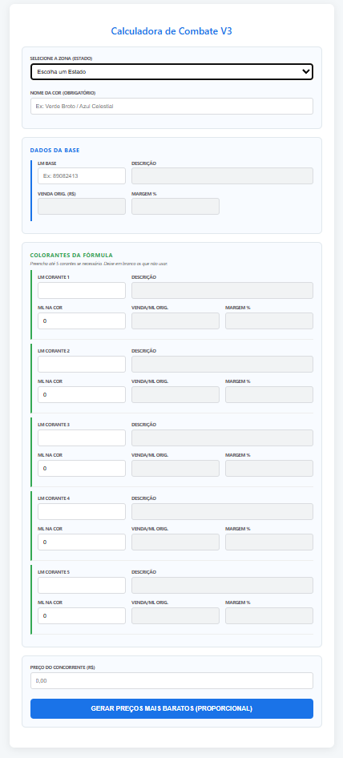
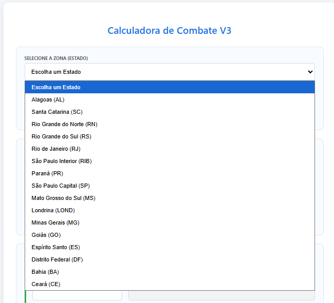
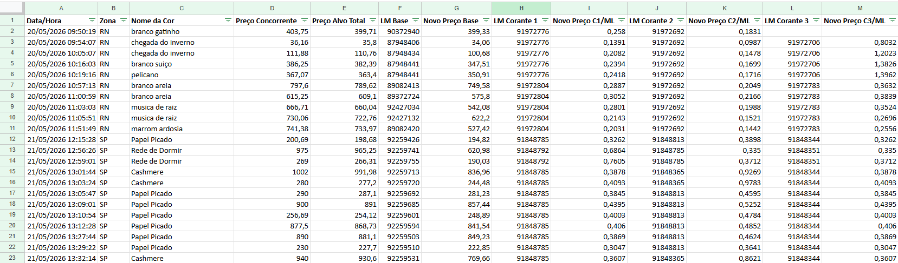

# 🎨 Calculadora Inteligente de Combate de Preços (Tintometria)

Uma solução automatizada desenvolvida em **Google Apps Script** e integrada com o **Google Sheets** projetada para otimizar o processo de cobrir ofertas da concorrência no setor de tintas.

---

## 💼 O Problema de Negócio Resolvido
Em processos tradicionais de tintometria, quando um cliente pede um desconto com base no preço do concorrente, os sistemas reduzem o valor apenas sobre a **base** da tinta, o que destrói a margem de lucro do produto principal ou gera prejuízos localizados. 

Esta calculadora resolve isso aplicando um **fator de redução global e proporcional**. Ela calcula o custo combinado da base + até 5 corantes e aplica o desconto igualmente sobre todos os componentes da fórmula até atingir o preço ideal (1% mais barato que o concorrente), protegendo a inteligência financeira do negócio.

---

## 🛠️ Funcionalidades Principais
- **Consulta Inteligente:** O usuário escolhe a região/estado e digita o código do produto. O sistema faz uma busca imediata nas tabelas comerciais vigentes no Google Sheets.
- **Fator de Redução Global:** Em vez de sacrificar apenas a base, o algoritmo distribui o desconto de forma proporcional em cada mililitro ativo da fórmula.
- **Dados Estruturados:** Ao finalizar, todos os dados calculados são salvos automaticamente em colunas limpas e independentes na planilha de resultados para auditoria célere das lojas.

---

## 📸 Demonstração do Sistema

### 1. Interface de Usuário (Menu de Estados e Entrada de Dados)
Abaixo está a interface visual responsiva criada para o operador de loja:

### 2. Visão Completa dos Campos de Fórmulas
Campos dinâmicos para preenchimento de até 5 corantes simultâneos com busca de margem original:

### 3. Banco de Dados Estruturado (Google Sheets)
Os logs gerados após o clique no botão de cálculo, organizando perfeitamente a auditoria por colunas separadas:

---

## 💻 Tecnologias Utilizadas
- **Google Apps Script** (Lógica de back-end e integração com a API do Google Sheets)
- **JavaScript (ES6+)** (Motor de cálculo proporcional)
- **HTML5 / CSS3** (Interface do usuário limpa, moderna e responsiva)

---

## 📦 Como Instalar e Executar
1. Crie uma planilha no Google Sheets com as abas nomeadas pelas siglas dos estados (ex: SP, PR, RN).
2. Vá em **Extensões** > **Apps Script**.
3. Copie os arquivos `Codigo.gs` e `index.html` deste repositório para o seu editor de script.
4. Clique em **Implantar** > **Nova implantação** como *App da Web*.
5. Defina o acesso para *"Qualquer pessoa"* ou configure conforme as diretrizes da sua organização.
